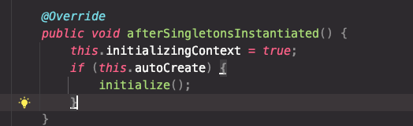
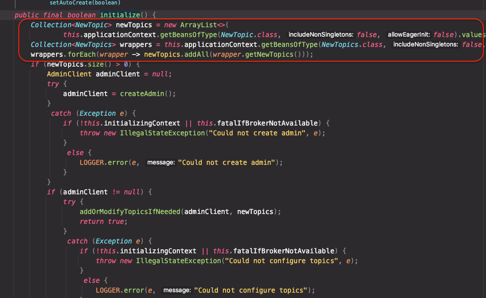
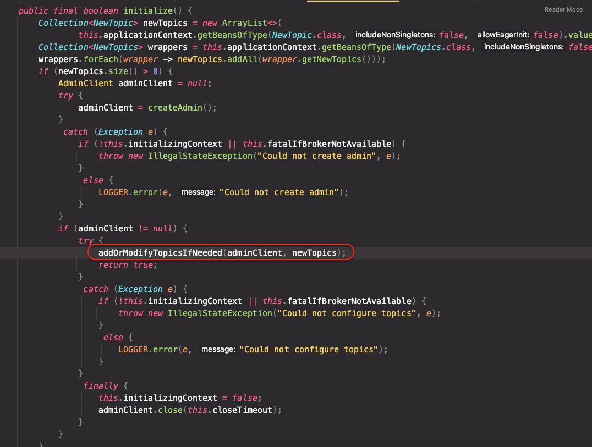
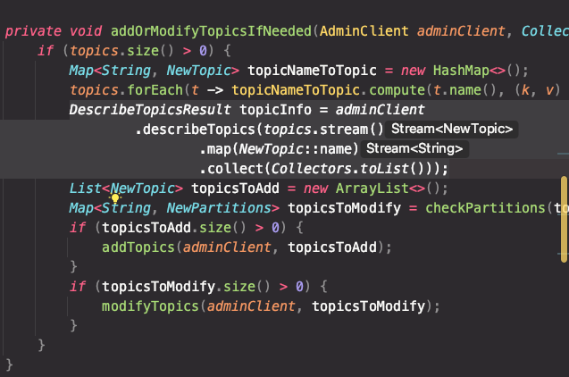
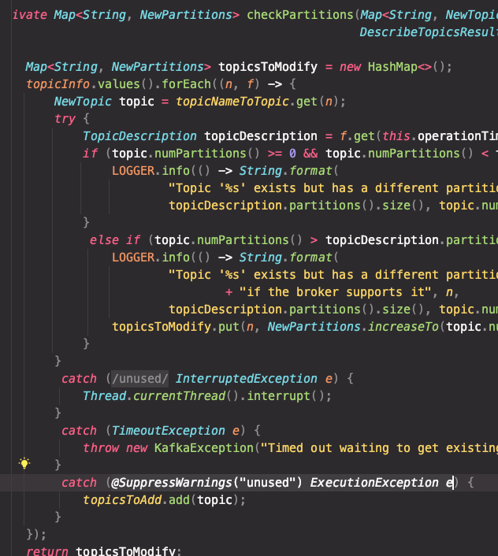
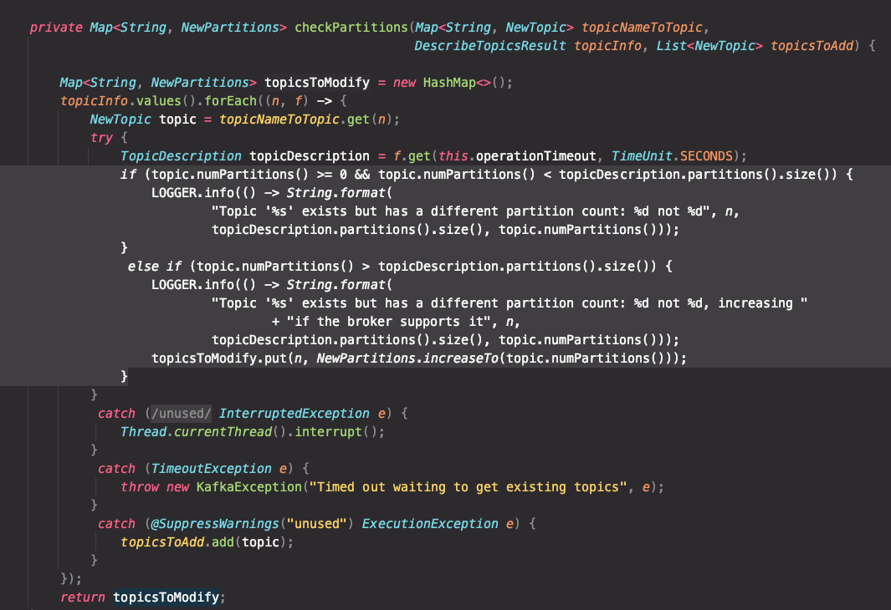

## 토픽 생성시 고려해야할 부분

### 토픽명
- Rule 을 정해 패턴화 하여 의미를 부여해야 한다.
  - 예) event.click.product.v1, event.write.comment.v1
- 토피명은 한번 정하면 바꾸기가 매우 어려움

### 토픽의 파티션 개수 계산
- 1 초당 메세지 발행 수 / Consumer Thread 1 개가 1초당 처리하는 메세지 수
- 1000 / 100 = 10 개의 파티션 필요
> 파티션 수를 늘릴순 있지만, 줄일 순 없음 <br/>
> 1. 보통은 파티션 수 1개에 컨슈머 수 1개가 매칭되게 만든다. <br/>
> 2. 빠른 메세지 처리를 위함
> 3. 파티션 수가 증가하면 스레드 수가 증가하게 된다.
> 4. 자연스럽게 서버가 더 필요하게되고 비용이 증가하게 된다. <br/>

> 요약하자면, 파티션 수와 컨슈머 수를 동일하게 맞추는 것은 병렬 처리의 최적화, 리밸런싱 문제 최소화, 메시지 처리 속도 향상, 자원 효율성 등의 이유로 Kafka의 성능을 최적화하고 시스템 자원을 효율적으로 사용하는 데 중요한 전략이다.

### Retention 시간
- Retention 시간 은 카프카 브로커가 메세지를 어느정도 보관할지 시간 이나 Byte 사이즈를 보고 초과하게 되었을때 자동으로 삭제하는 설정이다.  
- 디스크 크기와 데이터의 중요성에 따라 판단
  - 디스크 크기는 작은데 메세지가 많이 쌓이게 되면 디스크가 가득차 대형장애가 발생한다.
  - 메세지를 받을수도, 뽑아낼 수도 없기 떄문이다.
- 더불어, 시간을 매우 짧게 잡았다면, 데이터가 너무 빠르게 삭제가 되기 때문에, 메세지는 매우 빠르게 처리가 되어야 한다. 그래서 Retention 시간이 중요하다.

## KafkaAdmin

### 초기화 시점
```java
@Configuration
public class KafkaTopicConfiguration {

  @Bean
  public NewTopic clip() {
    return TopicBuilder
            .name("clip2")
            .build();
  }

  @Bean
  public KafkaAdmin.NewTopics clip2s() {
    // KafkaAdmin 이라는 객체가 초기화 되면서 만들어진다. -> SpringBoot 에서 AutoConfig 로 직접 만들어진다.
    return new KafkaAdmin.NewTopics(
            TopicBuilder.name("clip2-part1").build(),
            TopicBuilder.name("clip2-part2")
                    .partitions(3) // partition 의 갯수
                    .replicas(1) // Broker 가 local 환경에서 1대 이기때문에 1로 설정
                    .config(TopicConfig.RETENTION_MS_CONFIG, String.valueOf(1000 * 60 * 60)) // 1 시간의 Retention Time 을 갖는 Topic
                    .build()
    );
  }

}

```

- KafkaAdmin 이라는 객체가 초기화 되면서 만들어지는데, SpringBoot 에서 AutoConfig 로 직접 만들어진다.

### KafkaAdmin 내부

- 컨텍스트가 초기화 될 시점에 initialize() 메서드가 실행이 된다.
- initialize 메서드를 보면 new Topic, new Topics 두가지 @Bean 타입을 가지고 있는 컬렉션을 만들고, 이를 이용해 체크를 시작한다.

- 그런다음 addOrModifyTopicsIfNeeded 메서드에서, Topic 을 구분하게 된다.

- 그안을 살펴보면, 토픽의 정보를 조회해오는 부분을 살펴볼 수 있다.

- 그런다음 checkPartitions 라는 부분을 거치면 추가해야 될 토픽과 수정해야 될 토픽을 구분해서 작업을 하게 된다.

- topicNameToTopic.get(n); 을 하게 되었을때, 존재하지 않는 객체인 경우 ExcutionException 이 발생되게 된다.
- 그렇게 되면, 해당 토픽은 존재하지 않는것으로 판단하게 되고, Tipic 리스트에 새롭게 추가하게 되는것이다.

- 파티션의 갯수가 이미 존재하는 파티션의 갯수보다 적을경우, 동작하지 않게 되고
- 파티션의 갯수가 이미 존재하는 파티션의 갯수보다 큰 경우, modify 를 하게 된다.
  - 파티션의 변경 부분만 Bean 설정할때만 바뀐다.


### AdminClient 를 톺아보자.
```java
@SpringBootApplication
public class Chap1Clip1Application {

    public static void main(String[] args) {
        SpringApplication.run(Chap1Clip1Application.class, args);
    }

    @Bean
    public ApplicationRunner runner(AdminClient adminClient) {
        return args -> {
            // [1] 
            Map<String, TopicListing> topics = adminClient.listTopics().namesToListings().get();
            for (String topicName : topics.keySet()) {
                // [2]
                TopicListing topicListing = topics.get(topicName);
                System.out.println("topics.get(topicName) = " + topicListing);

                // [3]
                Map<String, TopicDescription> description = adminClient.describeTopics(Collections.singleton(topicName)).all().get();

                System.out.println("description = " + description);

                // [4]
                if (!topicListing.isInternal()) {
                    adminClient.deleteTopics(Collections.singleton(topicName));
                }
            }
        };
    }
}
```
- [1] : adminClient.listTopics().namesToListings() 를 보면 Topic 의 이름을 key 로 갖고, TopicListing 를 value 를 갖는 map 을 리턴하게 되어있다.
- [2] : TopicListing 객체는 토픽명과 internal 인지 여부정도만 보인다.
- [3] : Topic 의 세부정보를 보여준다. (Topic 명을 Collection 객체로 집어넣으면 모두 보여주게 된다.) 
  - topic 명, internal 여부, 파티션 정보까지도 확인할 수 있다.
  - ex) description = {clip2-part1=(name=clip2-part1, internal=false, partitions=(partition=0, leader=localhost:9092 (id: 0 rack: null), replicas=localhost:9092 (id: 0 rack: null), isr=localhost:9092 (id: 0 rack: null)), authorizedOperations=null)}
- [4] : deleteTopics 의 경우도 describeTopics 처럼 Topic 명을 Collections 객체로 집어넣게 되면 topic 이 제거된다.
  - 단, "!topicListing.isInternal()" 를 제어문으로 방어 코드를 해줘야 하는데, 그 이유는 internal offset 인 __consumer_offsets 를 삭제하면 안되기 때문이다.
    - __consumer_offsets 는 모든 Consumer 의 offset 정보를 담게 되는데, 이 토픽은 절대 삭제하면 안된다.

