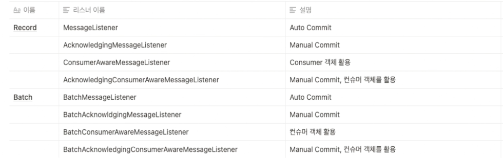
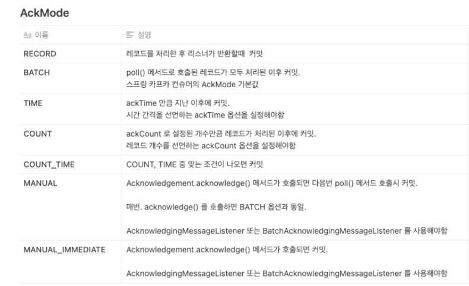

### Message Listener

- Message Listener
  - Record : 단일 메세지를 하나씩 처리
  - Batch : Record 를 List 타입으로 받아와서 한번에 처리

### Commit Method 의 AckMode

### Message Listener Container
- KafkaMessageListenerContainer
  - Single Thread
- ConcurrentMessageListenerContainer
  - kafkaMessageListenerContainer 인스턴스를 1개 이상 사용하는 Multi-Thread
  - start, stop 등 메소드를 foreach 로 순차적 실행
- 장점
  - start, stop, pause, resume 이 용이
  - 풍부한 AckMode 를 지원

### Retrying Deliveries
- 기본적으로 리스너에서 에러가 발생되면, Container Error Handler 가 동작하게 됨
- RetryingMessageListenerAdapter 를 이용해 Retry 기능을 호출
- RetryTemplate 과 RecoveryCallback<Void> 를 Container Factory 에 설정하여 사용
  - RecoveryCallback 의 설정되지 않으면 모든 재시도가 실패시 Container Error 가 발생

### Retry Stateful
- BackOffPolicy 를 이용해 재시도하는 과정에서 Consumer Thread 가 중지될 수 있음
- 재시도를 하는동안 poll() 이 수행되지 않기 떄문
- session.timeout.ms: 설정된 시간안에 heartbeat 를 받지 못하면 Consumer Group 에서 제거하고 rebalance 발생
- max.poll.interval.ms: 설정된 시간안에 poll() 이 호출되지 않으면 Consumer 가 죽었다고 판단.
  - 할당 파티션이 revoke 되고 rebalance 발생
