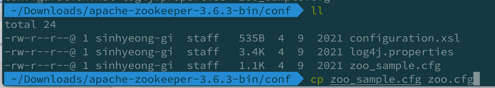
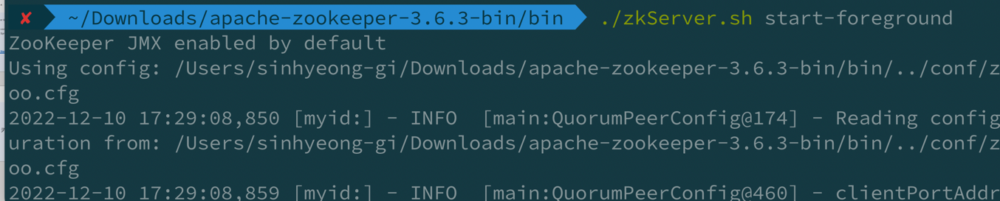
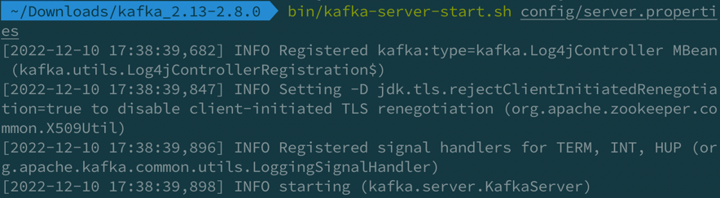
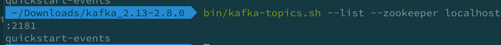

### Apache zookeeper 란
- 주키퍼 는 분산 애플리케이션을 위한 코디네이션 시스템이다. 분산 애플리케이션이 안정적인 서비스를 할 수 있도록 분산되어 있는 각 애플리케이션의 정보를 중앙에 집중하고 구성 관리, 그룹 관리 네이밍, 동기화 등의 서비스를 제공한다.

apache zookeeper -3.6.3 download
https://www.apache.org/dyn/closer.lua/zookeeper/zookeeper-3.6.3/apache-zookeeper-3.6.3-bin.tar.gz

압축을 간지나게 풀어줘보자.

```
$ tar -xvf [download 받은 파일]
```

- 처음 다운로드 받은뒤, 압축을 풀고 conf 파일에 들어가 보면 sample 파일이 보인다.
- 적절하게 cp 를 통해 복사해준다.



- 그런다음 bin 폴더에 들어가서 zkServer.sh start 를 통해 zookeeper 를 실행시켜준다.
- 명령어는 ./zkServer.sh start 또는 ./zkServer.sh start-foreground 이다. (foreground 는 실행시키면서 터미널에 로그를 보여준다.)




잘 실행된것을 볼 수 있다.

### Apache Kafka 란
- kafka 란 고성능 데이터 파이프라인, 스트리밍 분석, 데이터 통합 및 미션 크리티컬 애플리케이션을 위해 오픈 소스 분산 이벤트 스트리밍 플랫폼(distributed event streaming platform) 이다.
- 설치후 마찬가지로 서버를 시작해보자.



### 토픽 생성
#### 위 명령어를 통해 토픽을 생성해준다.
```
bin/kafka-topics.sh --create --topic quickstart-events --bootstrap-server localhost:9092
```
### 토픽 확인
bin/kafka-topics.sh --list --zookeeper localhost:2181




https://kafka.apache.org/downloads