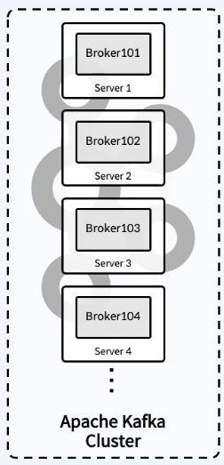
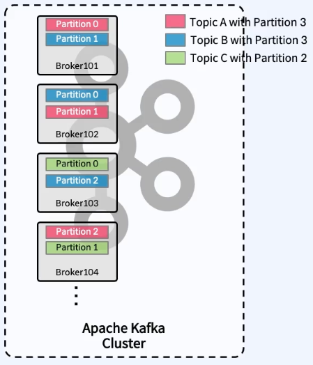
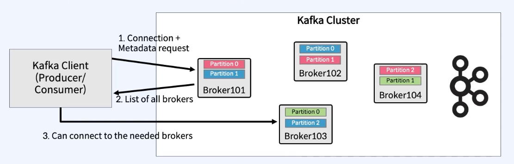
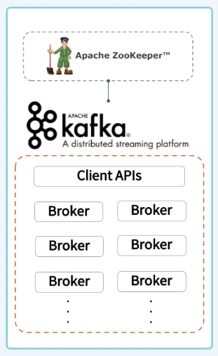
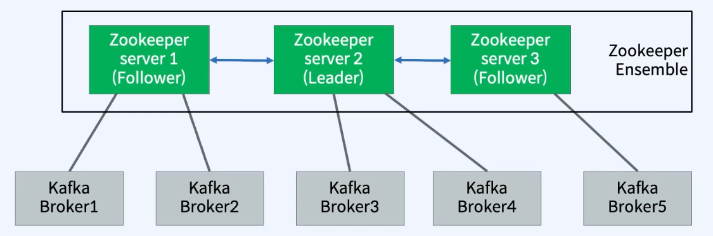
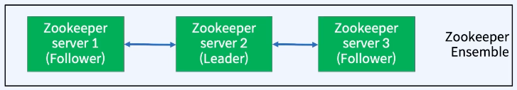

### Topic 과 Partition 을 유지 및 관리

- Kafka 의 서버 라고 부른다.
- Topic 내의 Partition 들을 분산, 유지 및 관리의 용도다.
- 각각 의 Broker 들은 ID 로 식별되며, ID 는 숫자로 관리된다.
- Topic 의 일부 partition 들을 포함한다.
  - Topic 데이터의 일부분 ( partition )을 갖을 뿐 데이터 전체를 갖고 있지 않음.
- Kafka Cluster : 여러개의 Broker 들로 구성된다.
- Client 는 특정 Broker 에 연결하면 전체 클러스터에 연결된다.
- 최소 3대 이상의 Broker 를 하나의 Cluster 로 구성해야 한다.
  - 4대 이상을 권장한다.

> 최소 3대 이상을 권장하는 이유에 대해서.
> 1. 리더 선출: 카프카는 주키퍼(ZooKeeper)를 사용하여 리더 선출한다.
> 2. 최소 3대의 브로커가 있어야 다수결로 리더를 선출할 수 있다. 
> 3. 2대의 브로커만 있으면 하나가 다운되었을 때 다수결이 불가능하다.
> 4. 데이터 복제: 카프카는 주키퍼를 통해 파티션을 여러 브로커에 복제한다. 
> 5. 최소 3대의 브로커가 있어야 데이터 복제가 제대로 이루어질 수 있다.

> 4대 이상의 브로커를 권장하는 이유에 대해서.
> 1. 내결함성: 3대의 브로커만 있을 경우, 한 대가 다운되면 두 대만 남게 되어 가용성과 데이터 복제에 문제가 생길 수 있습니다. 4대 이상의 브로커가 있으면 한 대가 다운되더라도 여전히 다수결로 리더를 선출할 수 있다.
> 2. 부하 분산: 브로커 수가 많을수록 데이터와 요청을 더 잘 분산할 수 있어 성능이 향상된다.
> 3. 유지보수: 유지보수 작업 중 하나의 브로커를 내리더라도 클러스터의 가용성과 성능에 큰 영향을 미치지 않는다.

> 결론   
> 따라서, 카프카 클러스터를 구성할 때 최소 3대 이상의 브로커가 필요하며, 4대 이상의 브로커를 사용하는 것이 더 안정적이고 효율적이다.

### Kafka Broker ID 와 Partition ID 의 관계

- 결론적으로 아무런 관계도 없다.
  - 파티션은 특정 순서 없이 브로커에 할당될 수 있다.
- Topic 을 생성시 Kafka 가 자동으로 Topic 을 구성하는 전체 Partition 들을 모든 Broker 에게 할당해주고 분배를 해준다.

> 즉, Kafka 클러스터는 파티션이 어디에 많이 생성되어 있고, 디스크 사용량이 어떤지 등을 고려하여 파티션의 최적 위치를 자동으로 결정한다. 이 과정에서 클러스터는 가장 적합한 브로커를 선택하여 해당 파티션을 할당한다.

### Client 가 브로커에 접속할때 어떻게 접속하는지 ? 

- 클라이언트는 부트스트랩 서버라는 파라미터를 사용하여 브로커에 접속한다.
  - 여기서 부트스트랩 서버는 카프카 클러스터 내의 모든 브로커를 의미한다.
- 클라이언트가 하나의 브로커에만 연결해도, 해당 브로커는 클러스터 내의 모든 브로커 리스트를 클라이언트에게 전달한다.
- 이 정보를 통해 클라이언트는 메시지를 주고받아야 할 토픽의 파티션이 어디에 위치하는지 알 수 있으며, 필요한 브로커에 자동으로 접속하여 연결을 유지한다.
  - 만약 클라이언트가 하나의 브로커에만 연결하고 해당 브로커(예: 브로커 101)가 장애가 발생하면, 클라이언트는 접속할 브로커를 잃게 된다.
- 따라서 장애 대비를 위해 전체 브로커 리스트를 콤마(,)로 구분하여 클라이언트 설정에 포함시키는 것이 일반적이다.

### Zookeeper 로 Broker 를 관리

- 카프카의 관점에서 Zookeeper는 브로커들을 관리하는 역할을 한다.
  - Zookeeper는 브로커들의 목록과 설정을 유지하고, 이를 클러스터 내의 모든 브로커에 전달하고 동기화(sync)하는 기능을 제공한다.
  - 이러한 기능 덕분에 카프카 클러스터는 브로커 간의 일관성을 유지하고, 클러스터의 상태를 효율적으로 관리할 수 있다.
- 변경 사항 에 대해서 kafka 에게 알림을 제공한다.
  - 예 ) Topic 제거/생성, Broker 추가/제거 등 의 상황
- Kafka 는  2.x까지 주키퍼 없이 동작할수 없다.
- Zookeeper 는 홀수의 서버로 동작하게 설계되어있다. (최소 3, 권장 5)

> Kafka 2.x 이후 버전에서는 Zookeeper 의존성을 제거하고 자체 메타데이터 관리 기능을 도입한 KRaft (Kafka Raft) 모드를 지원하기 시작했다. 그러나 2.x 버전에서는 여전히 Zookeeper가 필수적이다.

### Zookeeper는 왜 홀수의 서버로 동작하게 설계되었는가?
- Zookeeper는 분산 시스템에서 일관성을 유지하기 위해 쿼럼(Quorum) 기반의 합의 알고리즘을 사용한다.
- 쿼럼은 클러스터 내에서 동작하는 서버들 중 과반수 이상의 동의를 얻는 것을 의미한다.
- 홀수의 서버를 사용하면, 과반수를 쉽게 계산할 수 있어 합의에 도달하기가 용이하다. 예를 들어, 3대의 서버 중 2대, 5대의 서버 중 3대의 동의를 얻으면 쿼럼이 성립한다.
- 최소 3대의 서버를 사용하는 이유는 한 대의 서버가 장애가 발생해도 나머지 두 대가 쿼럼을 유지할 수 있기 때문이다. 이는 시스템의 가용성과 내결함성을 높인다.
- 권장되는 5대의 서버를 사용하는 경우, 두 대의 서버가 장애가 발생해도 나머지 세 대가 쿼럼을 유지할 수 있어 더욱 높은 안정성을 제공한다.
> 요약하면, Zookeeper는 쿼럼 기반의 합의 알고리즘을 사용하기 때문에 홀수의 서버를 사용하여 합의 과정을 단순화하고, 시스템의 가용성과 내결함성을 높이기 위해 최소 3대, 권장 5대의 서버로 구성하는 것이 좋다.

### 분산 작업을 제어하기 위한 Tree 형태의 데이터 저장소

- 위와 같은 형태의 3대이상, 혹은 5대로 구성되어 있는 주키퍼의 클러스터를 주키퍼 앙삼블 (Ensemble) 이라고 한다.
- 가운데에 있는 2번 서버가 리더 역할을 하고 양쪽의 1,3 은 팔로워 역할을 한다.
  - 리더에서 데이터를 가져가서 동기화 하는 구조이다. ( 분산 동기화 )
  - 대용량 분산 시스템에 동기화 시켜주는 네이밍 레지스트리 를 갖는 소프트웨어 이다.
    - 카프카의 브로커가 몇대인지, 토픽이 몇개이고, 파티션이 몇개인지 주키퍼가 모두 갖는데, 리더 (Leader) 가 갖고 있으며, 팔로워 (Follower) 들이 복제해서 갖고 있다.  

> 네이밍 레지스트리 란 ?  
> 1. 정의: 네이밍 레지스트리는 분산 시스템에서 서비스나 자원의 이름을 등록하고, 이를 통해 다른 서비스나 자원이 해당 이름을 통해 접근할 수 있도록 하는 서비스이다. 
> 2. 목적: 분산 환경에서 여러 서비스가 서로를 쉽게 찾고 통신할 수 있도록 돕기 위해 사용된다.

### Ensemble 은 Zookeeper 서버의 클러스터

- 주키퍼의 앙삼블은 쿼럼(Quorum) 알고리즘을 기반으로 한다.
- Quorum (쿼럼) 은 "정족수" 이며, 합의체가 의사를 진행시키거나 의결을 하는데 필요한 최소한도의 인원수 를 뜻함.
  - 과반수 이상의 정족수 (서버) 가 필요하다 -> 분산 코디네이션 환경에서 예상치 못한 장애가 발생해도 분산 시스템의 일관성을 유지시키기 위해서 사용
  - 예를들어 Ensemble 이 3대로 구성되어있다면 Quorum 은 2 가된다. Zookeeper 1대가 뒤져도 정상동작.
  - 예를들어 Ensemble 이 5대로 구성되어있다면 Quorum 은 3 이된다. Zookeeper 2대가 뒤져도 정상동작.
    - 근데 만약에 3대 뒤지면 정상 동작하는 서버가 2대가 되기때문에 정상 동작하지 않게 된다.
  - 만약 앙상블이 4대라면, 쿼럼은 3이 된다. 즉, Zookeeper 서버 1대가 장애가 발생해도 정상 동작하지만, 2대가 장애가 발생하면 정상 동작하지 않게 된다.

> 정리
> 1. Broker 는 Partition 에 대한 Read 및 Write 를 관리하는 소프트 웨어이다.
> 2. Broker 는 Topic 내에 Partition 들은 분산, 유지 및 관리
> 3. 최소 3대이상의 Broker 를 하나의 Cluster 로 구성해야한다. (4대 이상을 권장한다.)
> 4. Zookeeper 는 Broker 를 관리 하는 소프트웨어이다.
> 5. Zookeeper 는 홀수 서버로 작동하게 설계되어있다. (최소 3, 권장 5)
