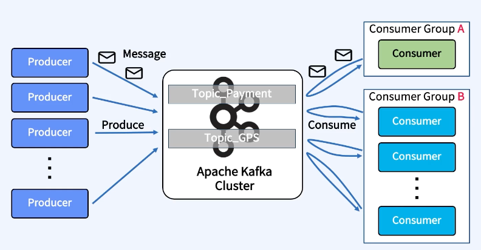

## 카프카의 주요요소

### Producer
- 메세지를 생상 (Produce) 해서 Kafka 의 Topic 으로 메세지를 보내는 애플리케이션

### Consumer
- Topic 의 메세지를 가져와서 소비(Consume) 하는 애플리케이션

### Consumer Group
- Topic 의 메세지를 사용하기 위해 협력하는 Consumer 들의 집합

> 하나의 Consumer 는 하나의 Consumer Group 에 포함되며, Consumer Group 내의 Consumer 들은 협력하여 Topic 의 메세지를 병렬처리함.

### Producer 와 Consumer 의 분리

- Producer 와 Consumer 는 서로 알지 못하며, Producer 와 Consumer 는 각각 고유의 속도로 Commit Log 에 Write 및 Read 를 수행
- 다른 Consumer Group 에 속한 Consumer 들은 서로 관련이 없으며, Commit Log 에 있는 Event(Message) 를 동시에 다른 위치에서 Read 할 수 있음.

### Record (Message) 구조

> 개발자가 다루는 영역은 Header 부분의 Topic 명, Key 와 Value 부분이다.  
> Key 와 Value 는 Avro, Json 등 다양한 형태가 가능하다.  
> 이렇게 보내지는 데이터를 Byte Array 로만 저장한다.  

### Record (데이터) 가 변환되는 과정

### Producer 애플리케이션에서 이루어지는 일 (아키텍처)

- 우리가 하는건 send 영역이다. Byte Array 로 변환이되고
- Partitioner 을 통해 어떤 파티션으로 갈것인지 정해지고
- Compress 를 통해 압축옵션이 있다면, 압축옵션이 진행이되고
- RecordAccumulator 로 보내져서 Batch 형태로 모여지거나 (옵션에 따라 다르지만) 건 by 건으로 전송이 되는 구조이다.
- 카프카는 이에 대한 응답을 주게 된다.
  - 성공을 하면 metadata 를 리턴하고
  - 실패하면 재시도 할것인지 안할것인지 옵션에 따라 재전송이 이루어진다

> send 이후에, 자동으로 라이브러리 내에서 이루어진다.

### Partitioner 의 역할 (Key 가 null 이 아닐경우)

- 그림을 보면 각 도형 을 특정 key 라고 가정할때 아래 알고리즘에 의해 Key 를 기반으로 Partitioner 가 어떤 파티션으로 보낼지 결정하게 된다
  - Partition = Hash(Key) % Number of Partitions
- 단) Key 가 null 이 아닐 경우이다.

### Partitioner 의 역할 (Key 가 null 일 경우)

- 버전 별로 다르다.
  - 2.4 이전의 경우 DefaultPartitioner 는 Round Robin 정책으로 동작한다.
    - 메세지를 파티션으로 각각 동시에 날려야 하는 경우이다.  
  - 2.4 이후의 경우는 DefaultPartitioner 가 Sticky 정책으로 동작하고 하나의 Batch 가 닫힐 때까지 하나의 Partition 에게 Record 를 보내고 랜덤으로 Partition 을 선택한다.
    - 6개의 메세지를 3개씩 묶어서 보내는 형태 이다. 총 2번만 날리게 되고 이는, Request 가 총 2번 발생하는것을 알 수 있다.
- Partitioner 는 Custom 하게 개발해서 교체가 가능하다.

### 요약
- Message == Record == Event == Data 모두 같은 말이다.
- Message 는 Header 와 Key 그리고 Value 로 구성된다.
- Kafka 는 Record (데이터) 를 Byte Array 로 저장한다.
- Producer 는 Serializer, Consumer 는 Deserializer 를 사용하여 데이터의 변환을 활용한다
- Producer 는 Message 의 Key 존재 여부에 따라서 Partitioner 를 통한 메시지 처리 방식이 다르다.
  - Key 가 있으면 Partitioner 가 동작 (Hash 알고리즘에 의해 분산처리를 해준다.)
  - Key 가 null 일 경우, 2.4 이전은 Round-Robin 방식으로, 2.4 이후는 Sticky 방식으로 메세지를 처리한다.

