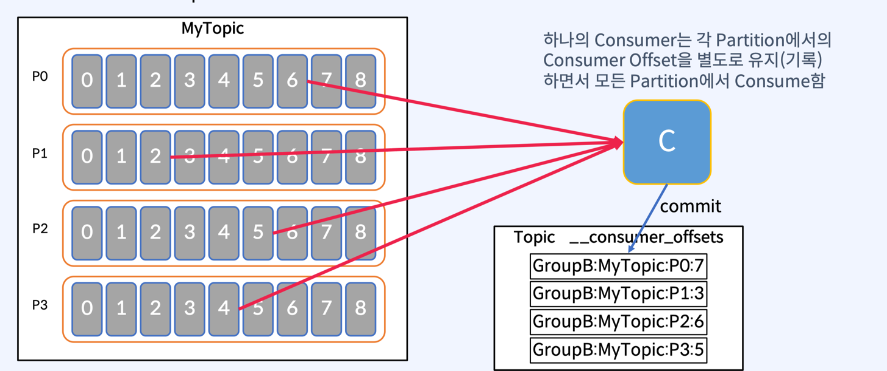

### Consumer

- 각각 고유의 속도로 Commit Log 로부터 순서대로 Read(Poll) 를 수행한다.
- 서로 다른 Consumer Group 에 속한 Consumer 들은 서로 관련이 없다. 
- 그림처럼 하나의 파티션에 서로 동시에 다른위치 에 있는 Commit Log 의 Offset Event (Message) 는 동시에 다른 위치에서 Read 할 수 있음.

### Consumer Offset

- Offset 은 Consumer Group 이 읽은 위치를 표시한다.
- Consumer 가 자동이나, 수동으로 데이터를 읽은 위치를 commit 하여 다시 읽음을 방지하기 위함이다.
  - Consumer Group A 가 MyTopic 이라는 파티션에서 offset 2 번에 위치한 데이터를 가져갔으면, 그러면 이 Consumer 는 그 다음위치인 3 번째 Offset 의 위치를 internal topic 인 __consumer_offsets 에 위치를 저장한다. 
  - 컨슈머 자체가 데이터를 가지고 있는게 아니라, internal Topic 에서 Consumer Offset 을 저장하여 관리한다는점 을 주의하자.

### 모든 Partition 에서 Consume

- Topic과 Partition:
  - Kafka Topic은 여러 개의 Partition으로 나뉘어져 있다. 예를 들어, MyTopic이 4개의 Partition으로 구성되어 있다고 가정한다.
- Consumer:
  - Single Consumer가 있을 때, 이 Consumer는 MyTopic의 모든 Partition에서 데이터를 읽어온다.
  - 즉, Consumer는 MyTopic의 4개의 Partition(P0, P1, P2, P3)에서 모든 Record를 Consume하게 된다.
- Offset 관리:
  - Consumer가 읽어간 이벤트(Record)의 Offset 정보는 Kafka의 내부 Topic인 __consumer_offsets에 저장된다.
  - 이 Offset 정보는 Consumer가 어디까지 데이터를 읽었는지 추적하는 데 사용된다. 이를 통해 Consumer가 재시작되더라도 이전에 읽었던 위치부터 다시 데이터를 읽을 수 있다.

> 따라서, Single Consumer가 Topic의 모든 Partition에서 데이터를 읽어가며, 읽은 위치(Offset)는 __consumer_offsets에 저장된다.

### Consumer Group

- Consumer 들은 Consumer Group 이라는 것을 만들 수 있게 되는데, 동일한 group.id 로 구성된 모든 Consumer 들은, Kafka 에 붙어서 데이터를 가져오게 되면, 자동으로 Group 이 만들어지게 된다.
  - 동일한 Group ID 를 가진 Consumer 들을 띄우면 Group 이 생성되는 간단한 구조이다.
- Partition 은 항상 Consumer Group 내의 하나의 Consumer 에 의해서만 사용됨.

### Multi Consumer Group 의 Partition 을 분배하여 Consume 하는 경우

- Consumer Group 내에 있는 Consumer 들은 Topic 에 있는 Partition 들을 어느정도 균등하게 분할해서 Consumming 하는 역할을 한다.
- 하나의 Topic 에서 consume 하는 여러 Consumer Group 이 있을 수 있음.
  - ex _) A 그룹은 정보계 애플리케이션 에서 데이터를 가져갈 수 있고, B 그룹은 마케팅용 시스템에서 데이터를 가져갈 수 있다.
- 서로 다른 Consumer Group 에 있는 Consumer 들은 서로 분리되어서, 각자 독립적으로 동작하는게 특징이다.

### Message Ordering (순서보장)

- 하나의 Topic 에 partition 이 2개 이상이면, Topic 내에 들어있는 전체 데이터에 대한 순서보장을 할 수 없다.
- 다시 말해, Topic 내에 들어있는 모든 메시지 (N 개의 Partition 이 있을 것이고, 이벤트가 분산해서 들어갈 것이다.) 이때, 전체 메시지에 대한 순서보장은 불가능하다.
- 파티션 별로 각각 동작하기 때문이다.
- Consumer 가 하나던 두 개던 상관이 없다.
  - 전체에 대한 순서보장이 불가능한 이유는 각 파티션이 독립적으로 메시지를 처리하고, 메시지가 각 파티션에 분산되어 저장되기 때문이다. 따라서, 여러 파티션에 걸쳐 있는 메시지의 순서를 보장할 수 없다.
  - 예를 들어, 메시지 A와 B가 순서대로 들어왔지만, A가 파티션 1에, B가 파티션 2에 저장되었다면, Consumer가 이를 처리할 때 순서가 뒤바뀔 수 있다.
- 또한, Consumer가 여러 개일 경우, 각 Consumer가 서로 다른 파티션의 메시지를 병렬로 처리하기 때문에 전체 메시지의 순서가 뒤섞일 가능성이 더욱 높아진다.
  - 이는 Kafka의 설계 특성상 각 파티션이 독립적으로 처리되기 때문에 발생하는 문제이다.

> 해결 방법  
> Partition 을 1개로 구성하면, 모든 메세지에서 전체 순서 보장 가능 하다.  

### 순서보장에는 정확한 판단이 필요하다.

- 사용자 A 가 web 화면에 들어와서, 상품을 조회한다고 가정하자. 클릭을 겁나했다고 보자. 그때 A 사용자가 어떤걸 클릭했는지 순서를 보장하면서, 데이터를 뭔가 처리하고 싶을때 ( 이런 경우가 많다고 한다. )
  - 특정 사용자가 어떤 클릭을 하고 있는지 분석을 하는 경우.
- N 명의 사용자 의 클릭 이벤트에 대한 순서를 보장해서 전체 데이터의 순서까지 보장한다 라는건 엄청난 성능감소를 야기하게 된다.

> 특정 테이블에 특정 Key 를 갖는 Row 데이터만 변경되는것이 순서를 보장하면서, Kafka 에 들어오고, 이를 활용하는 시스템으로 사용하게 되는 경우가 훨씬 많다.  
> 즉, Key 로 구분할 수 있는 메세지들의 순서 보장이 필요한 경우가 많다.

### Key 를 사용하여 Partition 별 메세지 순서 보장

- 동일한 Key 를 가진 메시지는 동일한 Partition 에만 전달되어 Key 레벨의 순서 보장 가능
  - 멀티 Partition 사용 가능 = 처리량 증가

> Kafka 본연의 기능인 MultiPartition 만으로도 해소가 가능하다  
> Key 만 맞춰서 보내면 Hashing 알고리즘에 의해 Key 별로 데이터가 들어갈테니까. (다른 뭔가를 하지 않더라도.)  
> Consumer 가 1 개든, N 개든 상관없다. 순서는 똑같이 보장이 된다.  

### 그러나, 운영 중에 Partition 개수를 변경하면 순서 보장이 불가능하다.
- 해싱 알고리즘은 메시지의 Key를 기반으로 Partition을 결정한다. 이때, Partition의 개수가 해싱 알고리즘의 입력으로 사용된다.
- 만약 운영 중에 Partition의 개수가 변경되면, 동일한 Key에 대해 해싱 알고리즘이 다른 Partition을 반환할 수 있다.
  - 예를 들어, 초기에는 4개의 Partition이 있었고, Key "user123"의 메시지가 Partition 2에 저장되었다고 가정하자.
  - 이후 Partition의 개수를 6개로 늘리면, 동일한 Key "user123"에 대해 해싱 알고리즘이 Partition 4를 반환할 수 있다.
  - 이로 인해, 동일한 Key를 가진 메시지들이 다른 Partition에 분산되어 저장되게 되어 순서 보장이 불가능해진다.
- Consumer는 각 Partition으로부터 메시지를 순서대로 읽지만, Key에 따른 순서가 뒤섞이게 된다.

> 따라서, 운영 중에 Partition 개수를 변경하면, 기존의 순서 보장 메커니즘이 깨지게 되어 메시지의 순서가 보장되지 않게 된다. 이는 Kafka의 설계 상의 특성으로, Partition 개수 변경 시 메시지의 순서 보장을 위해 추가적인 조치가 필요하다.

### Cardinality

- Key Cardinality 는 Consumer Group 의 개별 Consumer 가 수행하는 작업의 양에 영향이 있다.
- partition 이 4개 그리고, Consumer 가 4개라 가정해보자.
  - Key 의 분포를 잘못가지고 데이터를 보내게 되면 놀고 있는 consumer 와 바쁜 consumer 가 생기게 될 것이다.

> Key 선택이 잘못되면 부하가 고르지 않을수 있고, Integer, String 과 같은 단순한 유형일 필요가 없다.  
> Key 는 value 와 마찬가지로 Avro, Json 등 여러 필드가 있는 복잡한 객체 일 수 있다.  
> 따라서, Partition 전체에 Record 를 고르게 배포하는 Key 를 만드는 것이 중요하다.

### Consumer Failur ( 컨슈머 장애 )
- 장애가 났던 Consumer 가 땡겨갔던 파티션을 멀쩡한 다른 Consumer 가 Consume 하게 리벨런싱이 일어난다.
- 조건 은 다음과 같다.
  - Partition 은 항상 Consumer Group 내의 하나의 Consumer 에 의해서만 사용됨
  - Consumer 는 주어진 Topic 에서 0개 이상의 많은 Partition 을 사용할 수 있다.

> 컨슈머가 장애가 나는 경우는 여러 가지가 있다.
> 1. 네트워크 문제로 인해 Kafka 브로커와의 연결이 끊어지는 경우
> 2. 컨슈머 애플리케이션 자체의 버그나 예외 처리 미비로 인해 장애가 발생하는 경우
> 3. 컨슈머 그룹 내에서 리밸런싱이 빈번하게 발생하여 일시적으로 메시지 처리가 중단되는 경우
> 4. 시스템 자원 부족(메모리, CPU 등)으로 인해 컨슈머가 정상적으로 동작하지 않는 경우
> 5. Kafka 브로커의 장애로 인해 컨슈머가 메시지를 가져오지 못하는 경우
> 6. 메시지 처리 로직에서 예상치 못한 데이터나 포맷을 받아 처리하지 못하는 경우

### 정리
- Consumer 가 자동이나 수동으로 데이터를 읽은 위치를 commit 하여 다시 읽음을 방지한다.
  - __consumer_offsets 라는 Internal Topic 에서 Consumer Offset 을 저장하여 관리한다.
- 동일한 group.id 로 구성된 모든 Consumer 들은 하나의 Consumer Group 을 형성한다.
- 다른 Consumer Group 의 Consumer 들은 분리되어 독립적으로 작동 한다.
- 동일한 Key 를 가진 메세지는 동일한 Partition 에만 전달되어 Key 레벨의 순서 보장이 가능하다. ( hash 알고리즘에 의해서. )
- Key 선택이 잘못되면 작업부하가 고르지 않을 수 있다.
- Consumer Group 내의 다른 consumer 가 실패한 Consumer 를 대신하여 Partition 에서 데이터를 가져와서 처리함