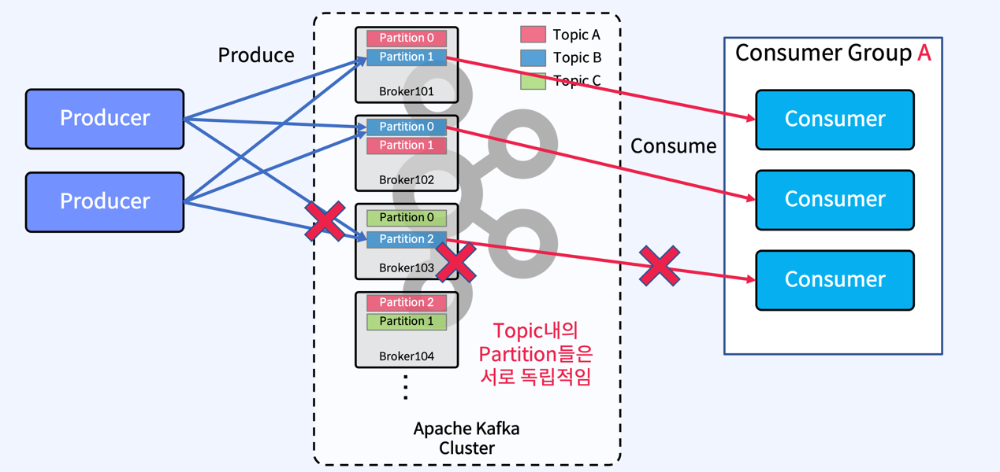
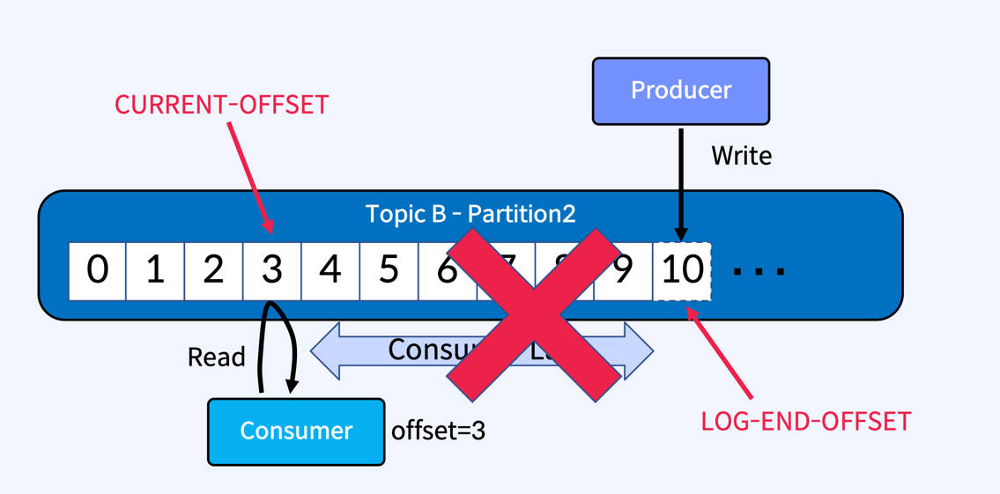
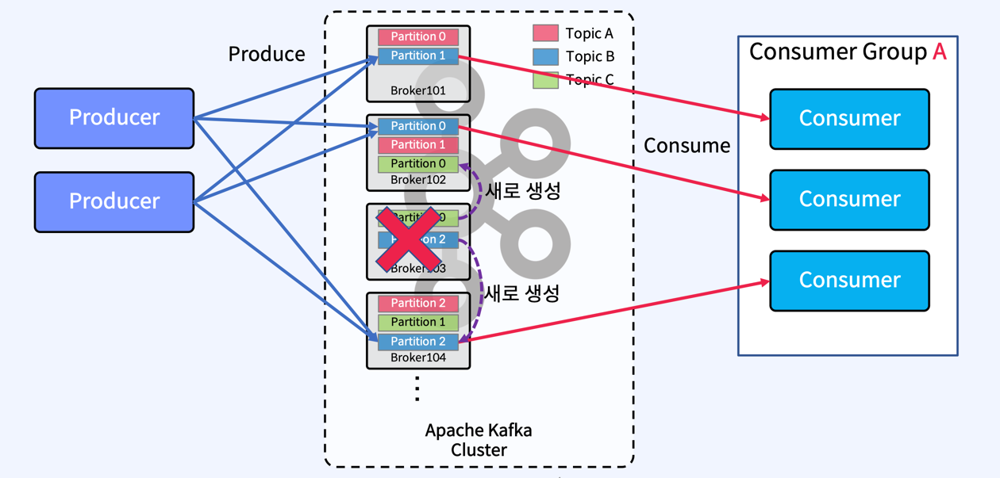
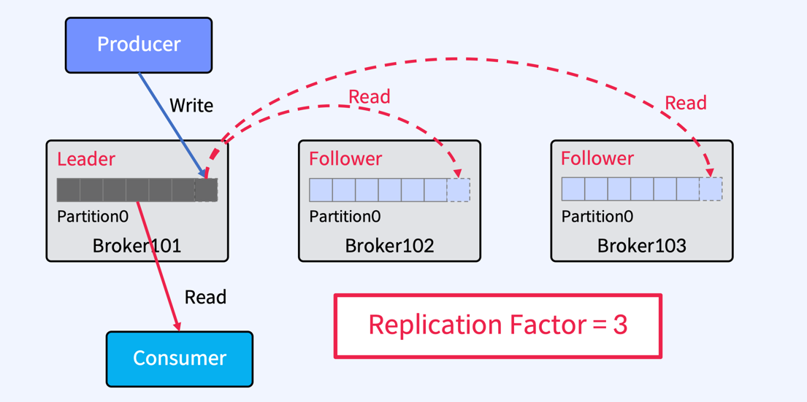
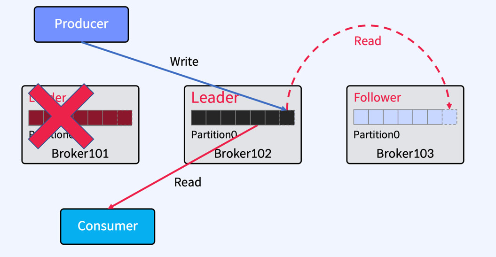
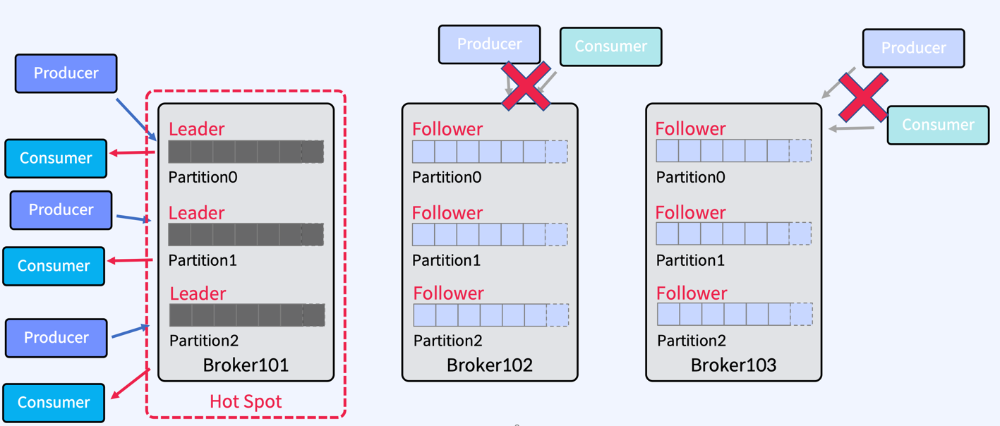

### Broker 에 장애가 발생할 경우

- producer 가 메세지를 만들어서 partition 으로 메세지를 보내고 들어온 데이터를 Consumer 가 consume 해서 데이터를 가져갈때 장애가 발생할 경우 
- Broker 103 이 뒤지면 메세지를 만들었던 Producer 와 Consumer 는 데이터를 보낼수도, 받을수도 없는 상황이 발생한다.

### Message, Offset

- Offset 정보 ( Write 하거나, Read 해가거나 할때, 그리고 파티션의 마지막 정보인 Log-end-offset 이나, Consumer 가 읽어가는 Current-offset 이나 이것의 차이인 Consumer Lag )
  - 장애가 나면 모두 정상적인 활동을 할 수 없다.

### partition 을 다른 Broker 에 새로 생성하면 어떨까 ? 

- Broker 103 이 뒤져서 102 와 104 에 있는 Partition 을 새로 만들면 ?
  - 기존 메세지는 버릴것인가 ? 기존 Offset 정보들을 버릴것인가?

### 이를 극복하기위해 Replication ( 복제 )

- Partition 을 복제 (Replication) 하여 다른 Broker 상에서 복제물 ( Replicas ) 를 만들어서 장애를 미리 대비함
  - Producer 로 부터 Write 가 이루어질때, 다른 Partition 에 복제물을 만든다.
  - 그림상으론 3개 (Leader, Follower 다 합해서) 의 복제물 이 존재한다.
- 원본데이터를 가지고 있는 Partition 을 Leader Partition 이라고 하고, 복제를 해가는 파티션을 Follower 파티션 이라고 한다.
- Follower 는 Broker 장애시 안정성을 제공하기 위해서만 존재한다.
- Follower 는 Leader 의 commit Log 에서 데이터를 가져오기 요청 ( Fetch Request ) 으로 복제
  - 여기서 중요한것은 Leader 가 주는게 아니라, Follower 가 복사할테니까 주세요 ~ 하는것
- Apache Kafka 2.4 부터는 Consumer 가 Follower Fetching (Read) 할수 있는 옵션을 제공한다.

### 장애시 Leader 를 선출

### 하나의 Broker 에만 Partition 의 Leader 들이 몰려있을 경우

- Broker 101 에만 I/O 바운드와 부하가 몰릴것이다. ( Hot Spot 상태)
  - 이를 방지하는 설정이 auti.leader.rebalance.enable 이고 (기본값은 켜져있다)
  - leader.imbalance.check.interval.seconds ( 기본값은 300 sec ) 300 초마다 Leader 의 불균형이 있나없나 체크
  - leader.imbalance.per.broker.percentage ( 기본값은 10 ) 다른 브로커보다 10% 더 많이 가져가면 이건 불균형 이다 라고 판단

### 요약
- Partition 을 복제 ( Replication ) 하여 다른 Broker 상에서 복제물 ( Replicas ) 을 만들어서 장애를 미리 대비함
- Replicas - Leader Partition, Follower Partition
- Producer 는 Leader 에만 Write 하고 Consumer 는 Leader 로부터로만 Read 함
- Follower 는 Leader 의 Commit Log 에서 데이터를 가져오기 요청 (Fetch Request) 로 복제
